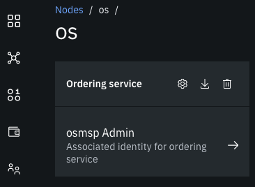
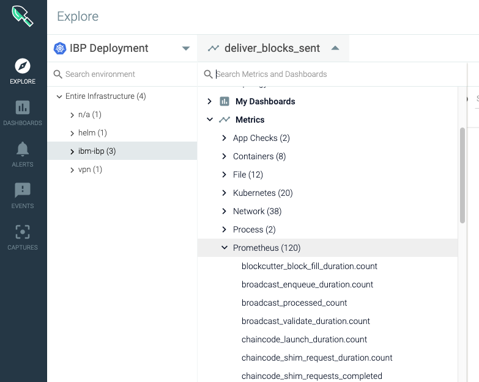

# Importing IBPv2 metrics to Sysdig

Starting in Hyperledger Fabric v1.4, operational metrics are available to be accessed: <https://hyperledger-fabric.readthedocs.io/en/release-1.4/operations_service.html> In IBPv2, these metrics are exposed using **Prometheus**

Assumptions:

* Name of organization is **Org1** (adjust accordingly)

## Prerequisites

You already have an IBPv2 network running and Sysdig connected to the Kubernetes cluster in which the IBPv2 network resides

## Create Monitoring Certificate-Key pair

Retrieving metrics from the peer requires mutual TLS authentication, so we need to generate a certificate-key pair. In **IBPv2 console**, go to **Nodes** > **Org1 CA**. Register a new user with enroll ID `monitoring` and enroll secret `monitoringpw`. Enroll this user against the **TLS Certificate Authority** and download the wallet. The file name of the wallet is assumed to be `Monitoring Org1.json`


Do the same for the orderer organization.  The file name of the wallet is assumed to be `Monitoring OS.json`

Decode the certificate and private key for `org1` and `os`:

```console
FILE_NAME="Monitoring Org1.json"
jq -r .private_key $FILE_NAME | base64 --decode > org1monitoring.key
jq -r .cert $FILE_NAME | base64 --decode > org1monitoring.pem
```

```console
FILE_NAME="Monitoring OS.json"
jq -r .private_key $FILE_NAME | base64 --decode > osmonitoring.key
jq -r .cert $FILE_NAME | base64 --decode > osmonitoring.pem
```

## Retrieve peer and orderer address

Before we proceed with the integration, let's check whether we are able to retrieve the metrics manually. The approach is different depending you are running on **free** or **paid** Kubernetes cluster. The tutorial below is for **Paid** cluster (refer [here](FreeCluster.md) for **Free** cluster)

Export the peer information. Assume that the filename of the json file is `peer1org1_peer.json`


Retrieve the Operation URL by issuing the following

```console
PEER_FILE_NAME=peer1org1_peer.json
PEER_ADDRESS=$(cat $PEER_FILE_NAME | jq -r .operations_url)
echo $PEER_ADDRESS
```

Export the orderer information. Assume that the filename of the json file is `os_orderer.json`



Retrieve the Operation URL by issuing the following

```console
ORDERER_FILE_NAME=os_orderer.json
ORDERER_ADDRESS=$(cat $ORDERER_FILE_NAME | jq -r .[0].operations_url)
echo $ORDERER_ADDRESS
```

## Retrieve metrics manually

Try to retrieve metrics from the peer and a bunch of metrics will appear. If you receive `curl: (35) error:1401E412:SSL routines:CONNECT_CR_FINISHED:sslv3 alert bad certificate` error, ensure that you have enrolled against `TLS Certificate Authority`

```console
$ curl -k $PEER_ADDRESS/metrics --cert org1monitoring.pem --key org1monitoring.key -v
...
# HELP promhttp_metric_handler_requests_total Total number of scrapes by HTTP status code.
# TYPE promhttp_metric_handler_requests_total counter
promhttp_metric_handler_requests_total{code="200"} 101
promhttp_metric_handler_requests_total{code="500"} 0
promhttp_metric_handler_requests_total{code="503"} 0
* Connection #0 to host 184.172.247.204 left intact
```

Try the same with ordering service

```console
$ curl -k $ORDERER_ADDRESS/metrics --cert osmonitoring.pem --key osmonitoring.key -v
...
# HELP broadcast_enqueue_duration The time to enqueue a transaction in seconds.
# TYPE broadcast_enqueue_duration histogram
broadcast_enqueue_duration_bucket{channel="channel1",status="SUCCESS",type="CONFIG_UPDATE",le="0.005"} 1
broadcast_enqueue_duration_bucket{channel="channel1",status="SUCCESS",type="CONFIG_UPDATE",le="0.01"} 1
broadcast_enqueue_duration_bucket{channel="channel1",status="SUCCESS",type="CONFIG_UPDATE",le="0.025"} 1
broadcast_enqueue_duration_bucket{channel="channel1",status="SUCCESS",type="CONFIG_UPDATE",le="0.05"} 2
* Connection #0 to host 184.172.247.204 left intact
```

Create a secret in the namespace `ibm-observe`, which is the namespace where sysdig agent components reside (ensure you have installed Sysdig agent in your Kubernetes cluster. Refer to official documentations)

```console
$ ORG_NAME=org1
$ kubectl create secret generic ${ORG_NAME}-monitoring-secret --from-file=./org1monitoring.pem --from-file=./org1monitoring.key -n ibm-observe
secret/org1-monitoring-secret created
```

```console
$ ORG_NAME=os
$ kubectl create secret generic ${ORG_NAME}-monitoring-secret --from-file=./osmonitoring.pem --from-file=./osmonitoring.key -n ibm-observe
secret/os-monitoring-secret created
```

## Modify Sysdig Agent

Download the sysdig-agent `Daemonset` and `ConfigMap`:

```console
kubectl get daemonset sysdig-agent -n=ibm-observe -o=yaml > prod-sysdig-agent-daemonset-v2.yaml
kubectl get configmap sysdig-agent -n=ibm-observe -o=yaml > prod-sysdig-agent-configmap.yaml
```

Add secret `org1-monitoring-secret` and `os-monitoring-secret` in `prod-sysdig-agent-daemonset-v2.yaml`. Notice the `<-- add here` sign in the following. This is so that the sysdig-agent can read the cert and key of `operator`

```yaml
...
        - mountPath: /opt/draios/etc/kubernetes/config
          name: sysdig-agent-config
        - mountPath: /opt/draios/etc/kubernetes/secrets
          name: sysdig-agent-secrets
        - mountPath: /host/etc/os-release
          name: osrel
          readOnly: true
        - mountPath: /opt/draios/etc/kubernetes/ibp-org1 # <-- add here
          name: ibp-org1-secrets
        - mountPath: /opt/draios/etc/kubernetes/ibp-os # <-- add here
          name: ibp-os-secrets
...
      - name: sysdig-agent-secrets
        secret:
          defaultMode: 420
          secretName: sysdig-agent
      - name: ibp-org1-secrets # <-- add here
        secret:
          defaultMode: 420
          secretName: org1-monitoring-secret
      - name: ibp-os-secrets # <-- add here
        secret:
          defaultMode: 420
          secretName: os-monitoring-secret
```

Modify `prod-sysdig-agent-configmap.yaml` to add the metric endpoint for peers.  Notice the `<-- add here` sign in the following.

```yaml
...
    prometheus:
        enabled: true
        histogram: true # <-- add here
        process_filter: # <-- add here
          - include:
              port: 9443 # <-- port for peer metrics
              conf:
                path: "/metrics"
                use_https: true
                auth_cert_path: "/opt/draios/etc/kubernetes/ibp-org1/org1monitoring.pem"
                auth_key_path: "/opt/draios/etc/kubernetes/ibp-org1/org1monitoring.key"
          - include:
              port: 8443 # <-- port for orderer metrics
              conf:
                path: "/metrics"
                use_https: true
                auth_cert_path: "/opt/draios/etc/kubernetes/ibp-os/osmonitoring.pem"
                auth_key_path: "/opt/draios/etc/kubernetes/ibp-os/osmonitoring.key"
```

Apply the change to the `DaemonSet`

```console
$ kubectl apply -f prod-sysdig-agent-daemonset-v2.yaml -n ibm-observe
daemonset.extensions/sysdig-agent configured
$ kubectl get daemonset sysdig-agent -n=ibm-observe -o=yaml > prod-sysdig-agent-daemonset-v2.yaml
```

Apply the change to the `ConfigMap`

```console
$ kubectl apply -f prod-sysdig-agent-configmap.yaml -n ibm-observe
configmap/sysdig-agent configured
kubectl get configmap sysdig-agent -n=ibm-observe -o=yaml > prod-sysdig-agent-configmap.yaml
```

Make sure the agent(s) has status `Running` and `1/1` ready. The number of agents correspond to the number of worker nodes

```console
$ kubectl get pods -n ibm-observe
NAME                 READY   STATUS    RESTARTS   AGE
sysdig-agent-g6c8v   1/1     Running   0          115s
```

## View the new integration in Sysdig Monitor

Go back to Sysdig monitor and click on **Sysdig Spotlight Notification** (bottom left corner). After 5-10 minutes, there should be a Prometheus logo, which signifies integration with Prometheus metrics of IBP


In **Explore** tab, view that you can see the Prometheus metrics



## References

* <https://cloud.ibm.com/docs/services/Monitoring-with-Sysdig?topic=Sysdig-change_kube_agent>
* <https://sysdigdocs.atlassian.net/wiki/spaces/Monitor/pages/204603650/Integrate+Prometheus+Metrics+into+Sysdig+Monitor+UI>
* <https://hyperledger-fabric.readthedocs.io/en/release-1.4/metrics_reference.html>
