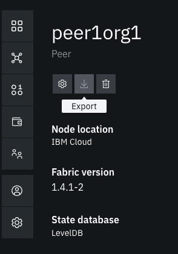

# Importing IBPv2 metrics to Sysdig

Starting in Hyperledger Fabric v1.4, operational metrics are available to be accessed: <https://hyperledger-fabric.readthedocs.io/en/release-1.4/operations_service.html> In IBPv2, these metrics are exposed using **Prometheus**

Assumptions:

* Name of organization is **Org1**
* Kubernetes free cluster is used

## Prerequisites

You already have an IBPv2 network running and Sysdig connected to the Kubernetes cluster in which the IBPv2 network resides

## Create Operator Certificate-Key pair

Retrieving metrics from the peer requires mutual TLS authentication, so we need to generate a certificate-key pair. In **IBPv2 console**, go to **Nodes** > **Org1 CA** > **TLS Certificate Authority**. Register a new user with enroll ID `operator` and enroll secret `operatorpw`. Enroll this user and download the wallet. The file name of the wallet is assumed to be `Operator Org1.json`


Decode the certificate and private key:

```console
FILE_NAME="Operator Org1.json"
jq -r .private_key $FILE_NAME | base64 --decode > operator.key
jq -r .cert $FILE_NAME | base64 --decode > operator.pem
```

## Check Metrics

Before we proceed with the integration, let's check whether we are able to retrieve the metrics manually. View the namespace where IBPv2 network reside. In the example below, `b4ecd3` is the namespace we are going to target in the subsequent steps.

```console
$ kubectl get ns
b4ecd3           Active   4d1h
default          Active   4d2h
ibm-cert-store   Active   4d2h
ibm-observe      Active   20h
ibm-system       Active   4d2h
ibpinfra         Active   4d1h
kube-public      Active   4d2h
kube-system      Active   4d2h
```

Get the NodePort of the operation port for peer. In the example below, operation NodePort for `peer0org1` is `32003`:

```console
$ NS=b4ecd3
$ kubectl get service -n $NS
NAME        TYPE       CLUSTER-IP       EXTERNAL-IP   PORT(S)                                                                      AGE
orderer0    NodePort   172.21.254.167   <none>        7050:30520/TCP,8443:31422/TCP,8080:30420/TCP,7443:30693/TCP                  3d22h
ordererca   NodePort   172.21.25.240    <none>        7054:31733/TCP,9443:32569/TCP                                                3d22h
org1ca      NodePort   172.21.230.161   <none>        7054:32720/TCP,9443:31767/TCP                                                4d
peer0org1   NodePort   172.21.23.30     <none>        7051:31306/TCP,7052:32229/TCP,9443:32003/TCP,8080:31109/TCP,7443:30710/TCP   3d23h
peer0org5   NodePort   172.21.125.141   <none>        7051:30573/TCP,7052:31110/TCP,9443:32320/TCP,8080:30038/TCP,7443:31315/TCP   3d17h
```

Get the public IP of the Kubernetes cluster. In the example below, the **Public IP** is `184.172.247.204`

```console
CLUSTER=aldred
ibmcloud ks workers --cluster $CLUSTER
OK
ID                                                 Public IP         Private IP      Machine Type   State    Status   Zone    Version
kube-hou02-pabc5ec22b156647589c380a9c135e5eae-w1   184.172.247.204   10.76.196.182   free           normal   Ready    hou02   1.13.6_1522
```

Try to retrieve metrics from the peer and a bunch of metrics will appear

```console
$ curl -k https://184.172.247.204:32003/metrics --cert operator.pem --key operator.key -v
...
# HELP promhttp_metric_handler_requests_total Total number of scrapes by HTTP status code.
# TYPE promhttp_metric_handler_requests_total counter
promhttp_metric_handler_requests_total{code="200"} 101
promhttp_metric_handler_requests_total{code="500"} 0
promhttp_metric_handler_requests_total{code="503"} 0
* Connection #0 to host 184.172.247.204 left intact
```

Let's try again without supplying the `cert` and `key` and **401** error will be received

```console
curl -k https://184.172.247.204:32003/metrics -v
...
< HTTP/1.1 401 Unauthorized
```

Create a secret in the namespace `ibm-observe`, which is the namespace where sysdig agent components reside

```console
$ ORG_NAME=org1
$ kubectl create secret generic ${ORG_NAME}-operator-secret --from-file=./operator.pem --from-file=./operator.key -n ibm-observe
secret/org1-operator-secret created
```

## Modify Sysdig Agent

Download the sysdig-agent `Daemonset` and `ConfigMap`:

```console
kubectl get daemonset sysdig-agent -n=ibm-observe -o=yaml > prod-sysdig-agent-daemonset-v2.yaml
kubectl get configmap sysdig-agent -n=ibm-observe -o=yaml > prod-sysdig-agent-configmap.yaml
```

Add secret `org1-operator-secret` in `prod-sysdig-agent-daemonset-v2.yaml`. Notice the `<-- add here` sign in the following. This is so that the sysdig-agent can read the cert and key of `operator`

```yaml
...
        - mountPath: /opt/draios/etc/kubernetes/config
          name: sysdig-agent-config
        - mountPath: /opt/draios/etc/kubernetes/secrets
          name: sysdig-agent-secrets
        - mountPath: /opt/draios/etc/kubernetes/ibp-org1 # <-- add here
          name: ibp-org1-secrets
...
      - name: sysdig-agent-secrets
        secret:
          defaultMode: 420
          secretName: sysdig-agent
      - name: ibp-org1-secrets # <-- add here
        secret:
          defaultMode: 420
          secretName: org1-operator-secret
```

Modify `prod-sysdig-agent-configmap.yaml` to add the metric endpoint for peers.  Notice the `<-- add here` sign in the following.

```yaml
...
    prometheus:
        enabled: true
        process_filter: # <-- add here
          - include:
              port: 9443 # <-- port for metrics
              conf:
                path: "/metrics"
                use_https: true
                auth_cert_path: "/opt/draios/etc/kubernetes/ibp-org1/operator.pem"
                auth_key_path: "/opt/draios/etc/kubernetes/ibp-org1/operator.key"
```

Apply the change to the `DaemonSet`

```console
$ kubectl apply -f prod-sysdig-agent-daemonset-v2.yaml -n ibm-observe
daemonset.extensions/sysdig-agent configured
$ kubectl get daemonset sysdig-agent -n=ibm-observe -o=yaml > prod-sysdig-agent-daemonset-v2.yaml
```

Apply the change to the `ConfigMap`

```console
$ kubectl apply -f prod-sysdig-agent-configmap.yaml -n ibm-observe
configmap/sysdig-agent configured
kubectl get configmap sysdig-agent -n=ibm-observe -o=yaml > prod-sysdig-agent-configmap.yaml
```

Make sure the agent is still running

```console
$ kubectl get pods -n ibm-observe
NAME                 READY   STATUS    RESTARTS   AGE
sysdig-agent-g6c8v   0/1     Running   0          115s
```

## View the new integration in Sysdig Monitor

Go back to Sysdig monitor and click on **Sysdig Spotlight Notification** (bottom left corner). After 5-10 minutes, there should be a Prometheus logo, which signifies integration with Prometheus metrics of IBP



In **Explore** tab, view that you can see the Prometheus metrics


## References

* <https://cloud.ibm.com/docs/services/Monitoring-with-Sysdig?topic=Sysdig-change_kube_agent>
* <https://sysdigdocs.atlassian.net/wiki/spaces/Monitor/pages/204603650/Integrate+Prometheus+Metrics+into+Sysdig+Monitor+UI>
* <https://hyperledger-fabric.readthedocs.io/en/release-1.4/metrics_reference.html>